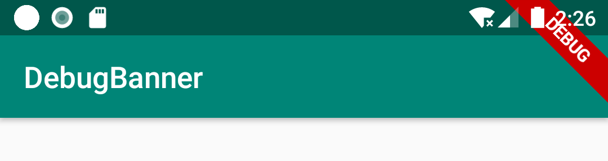
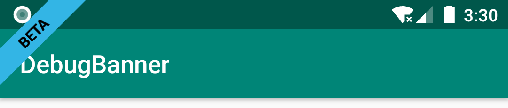

# DebugBanner
[](https://www.apache.org/licenses/LICENSE-2.0)
[ ](https://bintray.com/wangyao5018/maven/DebugBanner/_latestVersion)

调试显示选中的模式横幅标签(debug show checked mode banner label),看到flutter有这个功能.





## 使用
Gradle:
```groovy
implementation "com.github.wangyao5018:DebugBanner:1.0.4"
```

### 初始化
在Application里

```java
   /**
     *  默认,全部页面显示
     */
     DebugBanner.Companion.init(mInstance, new Banner());
```
or

```java
   /**
     * 过滤不显示的页面
     */
    DebugBanner.Companion.init(mInstance,
            new Banner(),
            false,
            "MainActivity",
            "ThreeActivity"
    );
```
or

```java
   /**
     * 过滤显示的页面
     */
    DebugBanner.Companion.init(
            mInstance,
            new Banner(),
            true,
            "MainActivity",
            "TwoActivity"
    );  
```

or

```java
    /**
     * 自定义样式
     */
    DebugBanner.Companion.init(
            mInstance,
            new Banner(BannerGravity.START, android.R.color.holo_blue_bright, android.R.color.holo_red_light, "BETA")
    );
```


## 额外
优化启动

```java
public class MyApplication extends Application {

  @Override
    public void onCreate() {
        super.onCreate();
        mInstance = this;

        runOnWorkThread(initThirdServiceRunnable);
    }

    private void runOnWorkThread(Runnable action) {
        new Thread(action).start();
    }

    /**
     * 子线程初始化,优化启动
     */
    private Runnable initThirdServiceRunnable = new Runnable() {
        @Override
        public void run() {
            //设置线程的优先级，不与主线程抢资源
            Process.setThreadPriority(Process.THREAD_PRIORITY_BACKGROUND);
	   /**
	     * release打包不显示
	     */
	    if (BuildConfig.DEBUG) {
		DebugBanner.Companion.init(mInstance, new Banner());
	    }


        }
    };
}
```
按照页面分别设置不同样式

```java
  public class ExampleActivity extends AppCompatActivity implements BannerView {

    @Override
    public Banner newBanner() {
        return new Banner(
	        BannerGravity.START, 
	        android.R.color.holo_blue_light, 
	        android.R.color.black, 
	        "BETA"
        );
    }
}

```

## 感谢
[https://github.com/armcha/DebugBanner](https://github.com/armcha/DebugBanner) 

看到flutter有这个功能,我是按照armcha/DebugBanner Library来写的,增加过滤Activity功能,armcha/DebugBanner是用Kotlin实现的.

        
        
        
        
        
        
        


