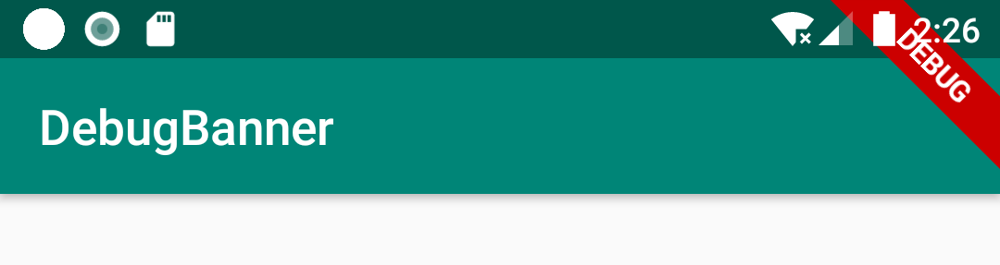
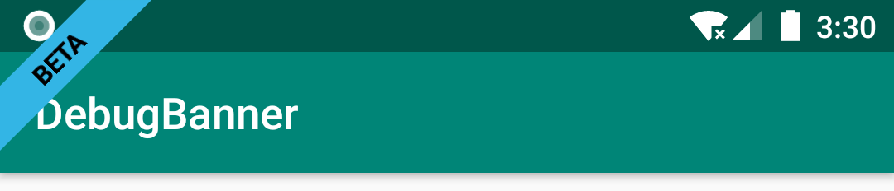

# [DebugBanner](https://github.com/wyjsonGo/DebugBanner)

[](https://www.apache.org/licenses/LICENSE-2.0)

> 调试横幅标签(debug show checked mode banner label)，看到flutter有这个功能。





## 使用

添加依赖

```groovy
dependencyResolutionManagement {
    repositoriesMode.set(RepositoriesMode.FAIL_ON_PROJECT_REPOS)
    repositories {
        ...
        maven { url 'https://jitpack.io' }
    }
}
```

[](https://jitpack.io/#wyjsonGo/DebugBanner)

```groovy
dependencies {
    implementation 'com.github.wyjsonGo:DebugBanner:1.0.10'
}
```

### 初始化

在Application里

```java
// 默认,全部页面显示
DebugBanner.Companion.init(this);
```

### 进阶用法

自定义初始化

```java
// 过滤不显示的页面
DebugBanner.Companion.init(
        this,
        new Banner(),
        false,
        "MainActivity",
        "ThreeActivity"
);

// 过滤显示的页面
DebugBanner.Companion.init(
        this,
        new Banner(),
        true,
        "MainActivity",
        "TwoActivity"
);

// 自定义样式
DebugBanner.Companion.init(
        this,
        new Banner(BannerGravity.START, android.R.color.holo_blue_bright, android.R.color.holo_red_light, "BETA")
);
```

不同页面设置不同样式，实现`BannerView`接口

```java
public class ExampleActivity extends AppCompatActivity implements BannerView {

    @Override
    public Banner newBanner() {
        return new Banner(
            BannerGravity.START,
            android.R.color.holo_blue_light,
            android.R.color.black,
            "BETA"
        );
    }
}

```
